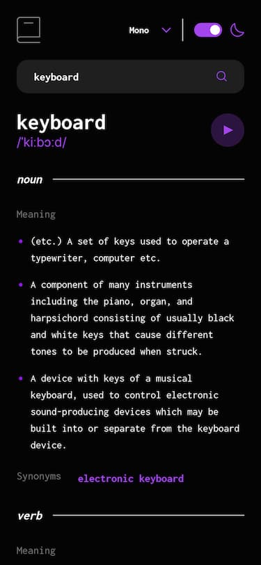
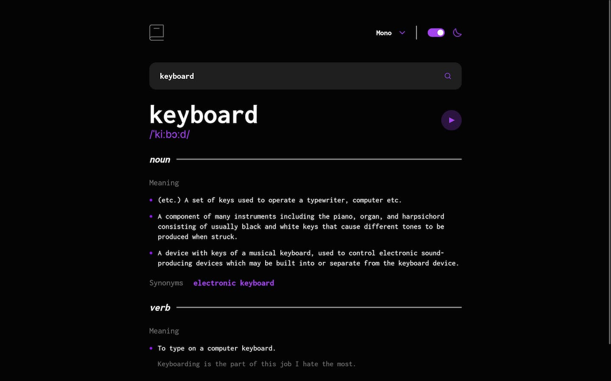

# Frontend Mentor - Dictionary web app solution

This is a solution to the [Dictionary web app challenge on Frontend Mentor](https://www.frontendmentor.io/challenges/dictionary-web-app-h5wwnyuKFL). Frontend Mentor challenges help you improve your coding skills by building realistic projects! 

## Table of contents

- [Overview](#overview)
  - [The challenge](#the-challenge)
  - [Screenshot](#screenshot)
  - [Links](#links)
- [My process](#my-process)
  - [Built with](#built-with)
  - [What I learned](#what-i-learned)
  - [Continued development](#continued-development)
  - [Useful resources](#useful-resources)
- [Author](#author)

## Overview

### The challenge

Users should be able to:

- Search for words using the input field
- See the Free Dictionary API's response for the searched word
- See a form validation message when trying to submit a blank form
- Play the audio file for a word when it's available
- Switch between serif, sans serif, and monospace fonts
- Switch between light and dark themes
- View the optimal layout for the interface depending on their device's screen size
- See hover and focus states for all interactive elements on the page
- **Bonus**: Have the correct color scheme chosen for them based on their computer preferences. _Hint_: Research `prefers-color-scheme` in CSS.

### Screenshot

- Solution in mobile 📱:



- Solution in desktop 💻:



### Links

- Solution URL: [Click here](https://www.frontendmentor.io/solutions/dictionary-web-app-h-URFeSKWy)
- Live Site URL: [See live site here](https://juanbonilla.me/FEM_dictionary-web-app)
- Storybook: [See storybook here](https://6490d8c43b79288498013e1b-xujjitvoum.chromatic.com/?path=/story/views-searchresultview--multiple-antonyms-result)

## My process

### Built with

- Semantic HTML5 markup
- CSS custom properties
- Mobile-first workflow
- [TypeScript](https://www.typescriptlang.org/) - Strongly typed programming language
- [React 18](https://reactjs.org/) - JS library
- [React Router](https://reactrouter.com/en/main) - Client side routing
- [Styled Components](https://styled-components.com/) - For styles
- [Storybook](https://storybook.js.org/) - For UI components in isolation
- [Vite](https://vitejs.dev/) - Build tool
- [Jest](https://jestjs.io/) - JS testing framework
- [Testing library](https://testing-library.com/) - Testing utility for UI components

### What I learned

In this project, I wanted to include new tools I saw in real work projects. I haven't tried [TypeScript](https://www.typescriptlang.org/) before, having the opportunity to start using it and understanding its power was great. I liked how TS helped me typing the variables, the way it provides suggestions based on what was configured in each interface, type or enum. I reckon sometimes it's kind of tough to create the explicit type I want in my code but on the other hand, you can always make some of the blocks reusable, meaning that in the future you will be grateful for spending more time resolving it the way you wanted and now, you just have to add the types and use the autocomplete function. For example, I needed to centralize a place for my fonts and create types according to the enum keys to use them in different interfaces across my project. See below the following snippet:

```ts
enum FontIds {
  sansSerif = 'Sans Serif',
  serif = 'Serif',
  mono = 'Mono'
};

type FontTypes = typeof FontIds;
type KeyOfFont = keyof FontTypes;
```

Doing this, I was able to control what my component receives. This way, I reduce the possibility of sending an invalid value and avoid the amount of errors in my console.

In addition, it has been amazing to discover [Storybook](https://storybook.js.org/). This tool provides the option of checking UI responsiveness, interaction, state, even accessibility support for each component. I played with some of the features and tried to customize some additional buttons in its UI interface. You can set up a global type object as follows:

```ts
export const globalTypes = {
  theme: {
    name: 'Theme',
    description: 'With this type you can change the theme in all components',
    defaultValue: 'light',
    toolbar: {
      icon: 'circlehollow',
      items: [
        { value: 'light', icon: 'circlehollow', title: 'light' },
        { value: 'dark', icon: 'circle', title: 'dark' },
      ],
    },
    showName: true
  },
}
```

Code above is pretty straightforward, this is what I was referring to when I mentioned the word "play" 😅. You can take that snippet and use it as you need. This worked really well for me as I was implementing a couple of contexts components to handle changes on the active theme and active font.

Last but not the least, I implemented styles with [Styled Components](https://styled-components.com/). It was great for me to add styles using this library since I wanted to know more about it. I found out in the documentation how to implement themes in an app, so it made sense to me. I was trying to find how to switch fonts in some of the components, I created a couple of solutions but one was interesting to me. I build a function in which I was able to access a context provided by `styled-components` and by getting an external value, a font id, I just had to include a `switch` block to just select the proper font. Below you can see the function I am talking about:

```ts
import { useContext } from 'react';
import { ThemeContext } from 'styled-components';
// More imports

const getCurrentFontFamily = (currentFont: KeyOfFont) => {
  const { fontFamily } = useContext(ThemeContext);

  switch(FontIds[currentFont]) {
    case FontIds.sansSerif:
      return fontFamily.Inter;
    case FontIds.serif:
      return fontFamily.Lora;
    case FontIds.mono:
      return fontFamily.Inconsolata;
  }
};
```

### Continued development

I would like to continue increasing my knowledge on TDD, so I consider it would be nice to have a tool that shows me the coverage for each line of code and help me identifying opportunities for new tests.

Apart from that, I identified the amount of context and provider files that I created. I think I can invest more time deciding whether to use a context or Redux when projects tend to scale.

Finally, this is the first time I've used GitHub Actions to deploy my project. I find it interesting to learn more about this tool and start understanding the importance of CI/CD.

### Useful resources

- [Accessibility tests with Storybook](https://storybook.js.org/docs/react/writing-tests/accessibility-testing) - This documentation is really helpful to understand how to tackle accessibility tests at an early stage of your development cycle.
- [Switch Example Using HTML Button](https://www.w3.org/WAI/ARIA/apg/patterns/switch/examples/switch-button/) - This article is great to create an accessible switch button. I have used this as a guide to implement the `<ThemeSwitcher />` component.
- [How to use emojis in React](https://medium.com/@seanmcp/%EF%B8%8F-how-to-use-emojis-in-react-d23bbf608bf7) - I found this article very interesting. Useful when you want to define a particular meaning to an emoji.
- [Emojis - Readability guidelines](https://readabilityguidelines.co.uk/images/emojis/) - I didn't know that emojis are actually accessible and this article explains in detail how to use them focusing on best practices. I decided to test this with the screen reader and I realized emojis have an alternative text by default. This way, you can insert them directly in your code instead of adding an additional label.
- [Deploying a Static Site to GitHub Pages with Vite](https://vitejs.dev/guide/static-deploy.html#github-pages) - I was struggling when deploying my project to GitHub Pages and this documentation was just enough to solve my problem. It shows how to deploy your project using GitHub Actions! 
- [Publish Storybook with Chromatic](https://www.chromatic.com/?utm_source=storybook_website&utm_medium=link&utm_campaign=storybook) - This site gives you the possibility to quickly deploy a storybook project created in one of your GitHub repositories. It has an easy-to-follow tutorial to get started. I have done my deployment on this site and will probably continue using it for my future projects.

## Author

- Website - [juanbonilla.me](https://juanbonilla.me)
- Frontend Mentor - [@juanpb96](https://www.frontendmentor.io/profile/juanpb96)
- LinkedIn - [Juan Bonilla](https://www.linkedin.com/in/juan-pablo-bonilla-6b8730115/)
